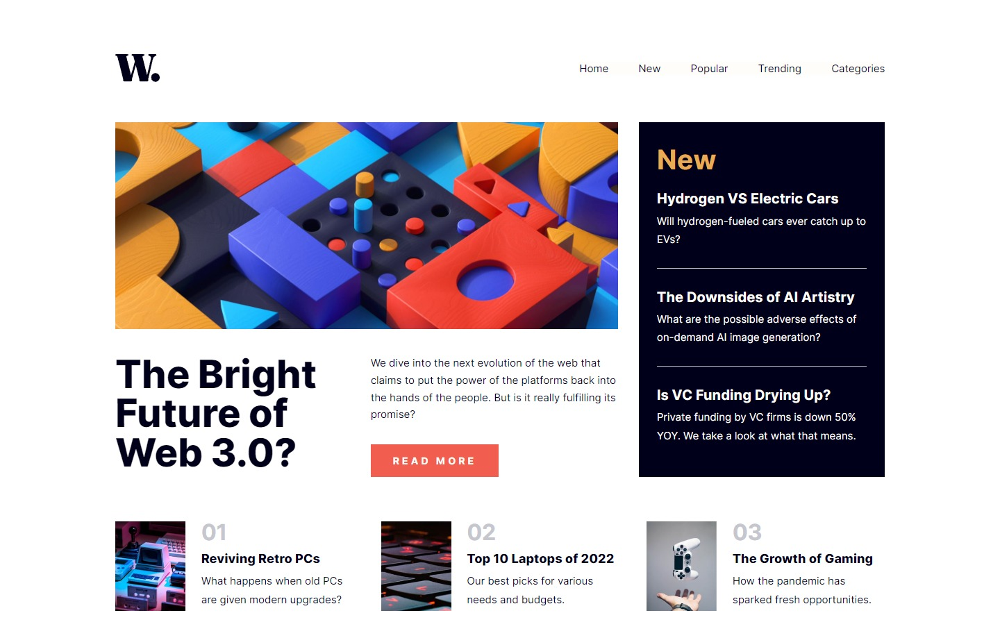

# Frontend Mentor - News homepage solution

This is a solution to the [News homepage challenge on Frontend Mentor](https://www.frontendmentor.io/challenges/news-homepage-H6SWTa1MFl). Frontend Mentor challenges help you improve your coding skills by building realistic projects.

## Table of contents

- [Overview](#overview)
  - [The challenge](#the-challenge)
  - [Screenshot](#screenshot)
  - [Links](#links)
- [My process](#my-process)
  - [Built with](#built-with)
  - [What I learned](#what-i-learned)
- [Author](#author)

## Overview

### The challenge

Users should be able to:

- View the optimal layout for the interface depending on their device's screen size
- See hover and focus states for all interactive elements on the page

### Screenshot

### Links

- Solution URL: [GitHub Repo](https://github.com/kemenyfa-szu/frontendmentor-025-news)
- Live Site URL: [GitHub Pages](https://kemenyfa-szu.github.io/frontendmentor-025-news)

## My process

### Built with

- Semantic HTML5 markup
- CSS custom properties
- Flexbox
- CSS Grid
- Mobile-first workflow

### What I learned

- I learned, how to handle openable and closeable nav menus on small screens.
- Played around/practiced with different layouts on in-between screen sizes
- Finally started to scratch the surface of container queries.

## Author

- Frontend Mentor - [@kemenyfa-szu](https://www.frontendmentor.io/profile/kemenyfa-szu)
